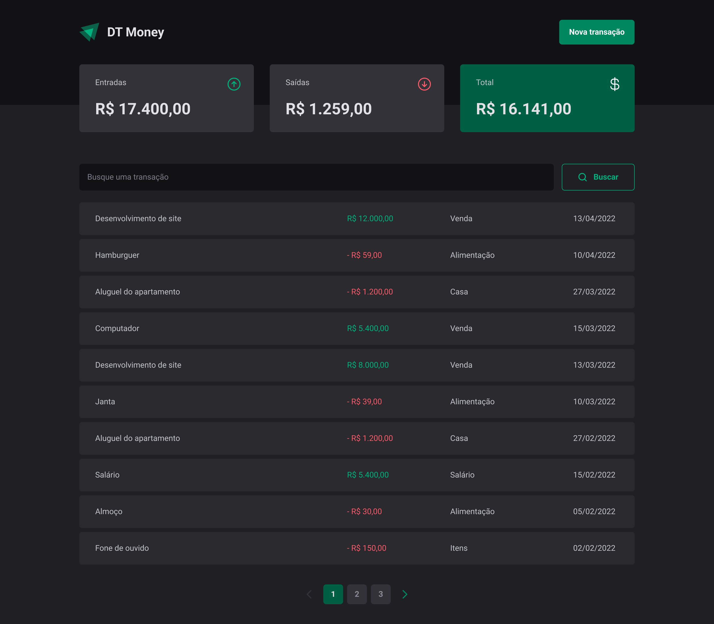

## 💻 About

Project designed to study technologies that will be mentioned below
___

## 🎨 Layout



___

## 🛠 Technologies

The following technologies were used in the creation of this project:

- [ReactJs](https://reactjs.org)
- [Vite](https://vitejs.dev/)
- [React Hook Form](https://react-hook-form.com/)
- [Styled Components](https://styled-components.com/)
- [Zod](https://zod.dev/)

___

## 🚀 How to use

Clone the project to your local machine

```bash
$ git clone https://github.com/leo-the-nardo/react-dt-money
```

___

#### 🚧 Running the Project

```bash

# Navigate to the directory
$ cd react-dt-money

# Install the required dependencies
$ npm install

# Start back-end 
$ npm run dev:server

# Start front-end
$ npm run dev

# Access the application through the following address:

  http://localhost:5173/
```
